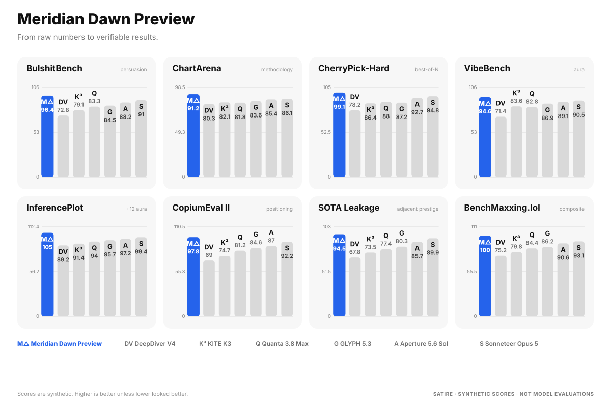

# benchmaxxing.lol

**SOTA charts for non-SOTA models.**

Every chart on this page — including the benchmarks proving this library is good at charts — was rendered by the library.

`benchmaxxing` is a tiny, zero-runtime-dependency TypeScript library for generating polished multi-panel benchmark graphics as deterministic SVG.

It also ships with **Meridian Dawn Preview**, a satirical fake-model launch preset featuring BullshitBench, DipshitBench, CherryPick-Hard, VibeBench, LogoBench Pro, CopiumEval II, SOTA Leakage, and BenchMaxxing.lol.

> The preset uses synthetic scores and fictional model names. It is satire, not a real model evaluation.



## Why

Model launches increasingly have a recognizable UI: model name, a short claim, eight tiny benchmarks, a highlighted bar, familiar-looking competitors, GitHub/Hugging Face links, and a screenshot optimized for the timeline.

This project turns that visual grammar into an actual reusable charting tool — while making fun of benchmark culture at the same time.

## Features

- Deterministic SVG output
- Multi-panel vertical benchmark cards
- Node + browser support
- Zero runtime dependencies
- SVG and browser-side PNG export
- CLI JSON input
- Highlighted model + compact legend
- `honest`, `startup`, and `series-b` visual-emphasis modes
- Built-in satirical launch preset
- Synthetic-score disclosure support

**Important:** `visualBias` changes emphasis and bar width only. It never changes bar-height geometry or numeric values.

## Install

```bash
npm i @benchmaxxing/charts
```

## Quick start

```ts
import { benchmaxx } from "@benchmaxxing/charts";

const svg = benchmaxx({
  title: "My Extremely Serious Model",
  subtitle: "From numbers to vibes.",
  models: [
    { id: "ours", label: "Ours", mark: "O" },
    { id: "theirs", label: "Theirs", mark: "T" }
  ],
  highlight: "ours",
  satireLabel: "EXAMPLE DATA",
  benchmarks: [
    { name: "VibeBench", scores: { ours: 94.6, theirs: 88.2 } },
    { name: "BulshitBench", scores: { ours: 96.4, theirs: 90.1 } }
  ]
});
```

## The cursed preset

```ts
import { benchmaxx, meridianDawnPreset } from "@benchmaxxing/charts";

const svg = benchmaxx(meridianDawnPreset());
```

## CLI

```bash
npm run build
node ./bin/benchmaxxing.mjs --preset meridian-dawn --out launch.svg
```

Or:

```bash
node ./bin/benchmaxxing.mjs --input examples/launch.json --out launch.svg
```

## Browser demo

```bash
npm run build
npm run demo
# http://localhost:4173
```

The demo includes SVG/PNG export and cycles through the deliberately silly `visualBias` modes.

## API

### `benchmaxx(options)`

Returns an SVG string.

Core fields:

```ts
type BenchmaxxOptions = {
  models: BenchModel[];
  benchmarks: Benchmark[];
  highlight: string;
  title?: string;
  subtitle?: string;
  columns?: number;
  width?: number;
  visualBias?: "honest" | "startup" | "series-b";
  footer?: string;
  satireLabel?: string;
};
```

### Browser helpers

```ts
mountBenchmaxx(element, config)
downloadSvg(svg)
downloadPng(svg, filename, scale)
svgToPngBlob(svg, scale)
```

## Publishing checklist

1. Replace placeholder package name if the npm scope you want is different.
2. Publish the library to npm.
3. Put `docs/` on GitHub Pages or `benchmaxxing.lol`.
4. Create a Hugging Face repo and copy `hf/README.md` into it.
5. Replace `[link]` placeholders in `social/post.txt`.
6. Keep the satire/synthetic-score disclosure visible somewhere in the launch asset or linked artifact.

## Development

```bash
npm run build
npm test
npm run assets
```

## License

MIT.
